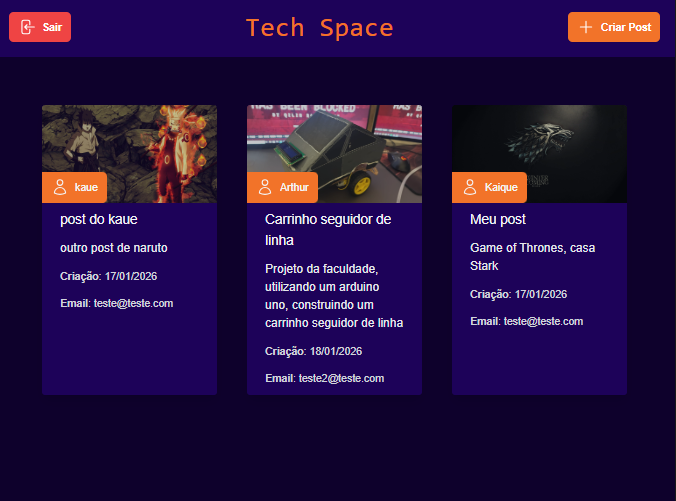

<h1 align="center">Projeto Dev Rede Social</h1>

Rede social criada para a interação geek entre usuários.

    <a href="#-tecnologias">Tecnologias</a>&nbsp;&nbsp; &nbsp;|&nbsp;&nbsp;&nbsp;
    <a href="#-projeto">Projeto</a>&nbsp;&nbsp; &nbsp;&nbsp;&nbsp;&nbsp;

 

    

## 👨🏿‍💻 Tecnologias

Esse projeto foi desenvolvido com as seguintes tecnologias:

- HTML e CSS
- JavaScript
- TypeScript
- React
- Git e GitHub

## 💻 Projeto

Tech Space é uma rede social geek criada para conectar apaixonados por tecnologia, games e cultura pop, oferecendo um espaço para compartilhar posts, imagens e experiências.